# Supra Software Engineering

## Herramientas utilizadas

- **Github:** Utilizado para compartir código entre los empleados para trabajar en paralelo en elementos del product backlog. Fue necesario la creación de varias ramas para poder dividir bien la implementación.
- **GitHub Desktop:** Utilizada conjuntamente con GitHUb la hemos usado para poder facilitar tanto la creación y unión de ramas como la realización de *commits*
- **Hibernate:** Utilizado en persistencia para guardar objetos en la base de datos utilizando la clase *AbstractEntityDAO*.
- **Maven:** Utilizado para controlar la configuración del proyecto y no tener problemas de versiones de software o de librerías entre los empleados.
- **Eclipse:** El entorno de desarrollo elegido para la implementación del código, principalmente para facilitar la implementación de la capa de presentación gracias a la extensión *WindowBuilder* y el tratado de datos de   la base de datos con la extensión *DBeaver*.
- **DerbyDB:** La base de datos elegida para este proyecto es la proporcionada por Apache ya que esta tiene una versión embebida que es perfecta para los requisitos del tratado de datos del proyecto.
- **Sonar:** Sonar se trata de una herramienta de análisis estático de código que hemos utilizado para poder observar varias características de nuestro código tales como los bugs, vulnerabilidades, *code Smells*, covertura y código duplicado.
- **JUnit:** Herramienta utilizada para poder realizar los distintintos test del código para asegurar la consistencia y la funcionalidad del código implementado.
- **Jacoco:** Jacoco se tratra de un plugin utilizado en Java para poder evaluar la covertura de los test realizados por la herramienta JUnit.
- **Miro:** Miro se trata de una aplicación web que hemos utilizado para la representación gráfica de los distintos sprints.

## Problemas

 - **Sonar:** Cuando comenzamos a utilizar esta herramienta, nos encontramos con la problemática de que únicamente nos analizaba la rama *main* la cual solo recibe actualizaciones cuando el código ya ha sido terminado y analizado, por lo que cambiamos esa configuración para que nos funcionase correctamente y así poder analizar nuestro código correctamente antes de poder sacarlo a producción.
 - **JUnit:** En el momento de realizar los test a uno de nuestros compañeros se le realizaban test de métodos no existentes y que portanto daban errores.
 - **Jacoco:** Uno de los problemas que mas quebraderos de cabeza nos han ocasionado ha sido con respecto a Jacoco ya que en el momento de realizar el análisis no era generado el .exec necesario para poder ver nuestra covertura en SonarCloud.
- **Maven:** Hemos tenido problemas de compatibilidad con maven dado que entre distintos compañeros nos encontrabamos con versiones distintas y por tanto alguno de ellos no podía realizar MavenBuild

## **BACKLOG DEL SPRINT 3**

- **Características del sprint:**

Duración: 2 semanas (10/11/22 - 24/11/22). Estimación de tiempo de trabajo: 16 horas.

Usaremos este sprint para acabar el código restante de la funcionalidad mínima y comenzar con el uso de SonarCloud para analizar el proyecto.  

Al acabarlo, será planteada una corta reunión retrospectiva sobre el sprint para analizar nuestro desempeño y efectividad a la hora de cumplir los objetivos en el plazo acordado. Con esto podremos preparar mejor el backlog del sprint 4.

- **Objetivos del Sprint:**
  - Seguir y llevar al día las clases de laboratorio.
  - Configurar Sonar.
  - Primeros análisis del proyecto con Sonar.
  - Observar y analizar los resultados del análisis de Sonar.
  - Revisión de los CdU de los Sprints 1 y 2.
  - CdU8: Login.
  - CdU9: Informes para evaluar propuesta.
  - Buscar soluciones alternativas a los problemas encontrados en Sonar.

**Notas:**

Este sprint comienza con el trabajo de una nueva herramienta, por lo que puede que parte del trabajo (como la búsqueda de alternativas a los problemas encontrados en Sonar) se arrastre hacia próximos Sprints.

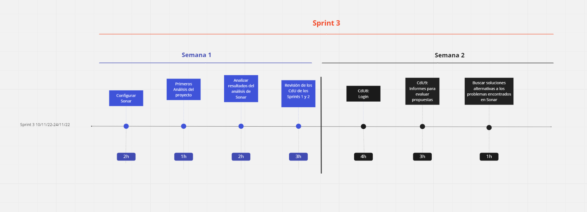
## **BACKLOG DEL SPRINT 4**

- **Características del sprint:**

Duración: 2 semanas (24/11/22 - 8/12/22). Estimación de tiempo de trabajo: 15 horas.

Usaremos este sprint para instalar el entorno de desarrollo de pruebas y comenzar con los tests. También nos encargaremos de reducir los CodeSmells, bugs y código duplicado.  

Al acabarlo, será planteada una corta reunión retrospectiva sobre el sprint para analizar nuestro desempeño y efectividad a la hora de cumplir los objetivos en el plazo acordado. Con esto podremos preparar mejor el backlog del sprint 5.

- **Objetivos del Sprint:**
  - Instalación del entorno de pruebas.
  - Solucionar problemas relacionados con Sonar y POM.
  - Reducir código duplicado.
  - Reducción CodeSmells y bugs de controladores.
  - Reducción CodeSmells y bugs de entidades.
  - Reducción CodeSmells y bugs de persistencia.
  - Reducción CodeSmells y bugs de presentación.
  - Unión de pantallas ConsultarCurso.
**Notas:**

En este sprint, nos dedicaremos a corregir los problemas detectados con SonarCloud e instalaremos el enterno de pruebas para comenzar con los test en el proyecto.

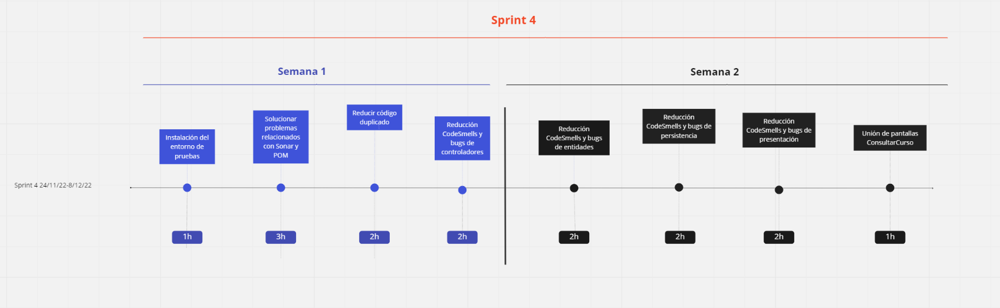

## **BACKLOG DEL SPRINT 5**

- **Características del sprint:**

Duración: 2 semanas (8/12/22 - 22/12/22). Estimación de tiempo de trabajo: 17 horas.

En este sprint acabaremos los test del código junto con sus tablas. Tras acabar el periodo de reducción de CodeSmells, bugs y código reducido, haremos una revisión final de los informes de SonarCloud y terminaremos con un resumen del estado del sistema tras la ejecución del plan basado en el análisis de Sonar. Por último terminaremos con un análisis de la mejora de calidad del proyecto.

Para finalizar el sprint, redactaremos la memoria de la entrega final y haremos las comprobaciones finales del proyecto a entregar.

Siendo este el último Sprint, cualquier problema que haya sido arrastrado de otros sprints o encontremos en el sprint actual terdrá que ser resuelto sin excepción. Esto podría significar un aumento de la carga de trabajo.

- **Objetivos del Sprint:**
  - Definición del plan de mantenimiento.
  - Tests del código y tablas de los tests.
  - Reducción final de CodeSmells y bugs.
  - Revisión final de los informes generados por las herramientas (SonarCloud).
  - Revisión y resumen final del estado del sistema, tras la ejecución del plan basado en el  análisis de SonarCloud.
  - Análisis de la mejora de calidad.
  - Memoria de la entrega final.
  - Comprobaciones finales del proyecto a entregar.
**Notas:**

En este sprint nos centraremos en mantenimiento y analizar los informes de Sonar y el resumen final del estado del sistema.
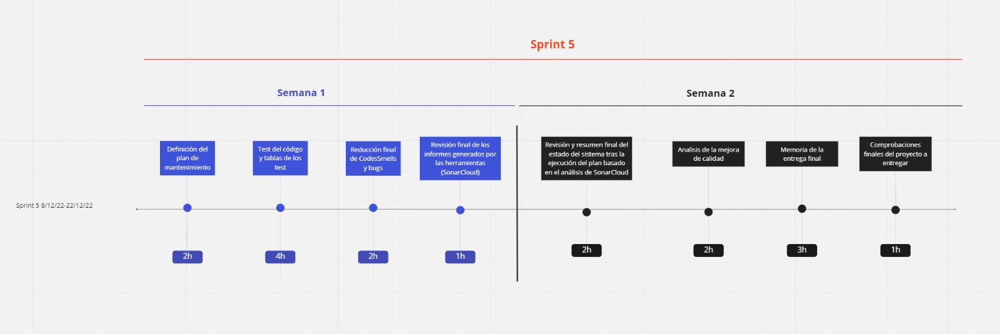

 ## Mantenimiento
 
 Para la gestión del mantenimiento de nuestro programa hemos utilizado esencialmente SonarCloud donde observábamos un análisis detallado de lo que contenía nuestro código.  
 El primer análisis realizado el día  nos muestra lo siguiente:     
 
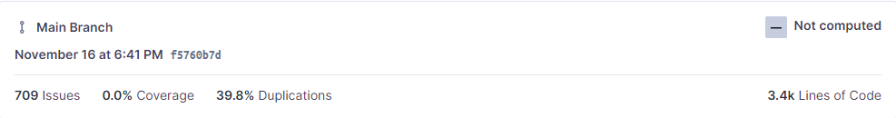

 Uno de los mayores  problemas que pudimos observar era la gran cantidad de código duplicado que ascendía hasta el 39.8% y que supone un problema con respecto a la calidad de nuestro código, según SonarCloud el código duplicado idóneo no debería superar el 3% de todo el código.

Tras una exhaustiva investigación encontramos el origen de todo este código duplicado se encontraba en la capa de presentación, dado que todas las pantallas que utilizabamos eran prácticamente iguales. Para reducir el código duplicado  principalmente en declaraciones de variables comunes en todas las pantallas implementamos la clase *PantallaPadre* en la que englobamos muchas de estas variables para que el resto de clases pudiesen heredar de esta y así reducir el problema del código duplicado.

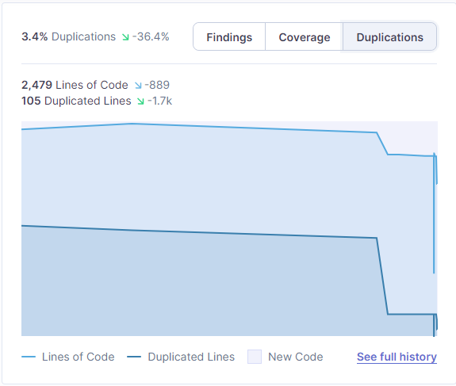

Otro de los problemas encontrados es la gran cantidad de *CodeSemlls* encontrados que al inicio ascendían hasta la cantidad de: 648.  

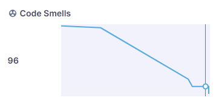

También teníamos 2 Vulnerabilidades y 23 bugs que finalmente pudimos solucionar y tener 0 vulnerabilidades y 0 bugs y además para mejorar el análisis de sonar en nuestro programa editamos algunas de las reglas establecidas.

Para mejorar la cobertura de nuestro programa comenzamos a realizar distintos test en los gestores como GestorLogin en el que conseguimos una covertura del 90% tras implementar test en los métodos utilizados en estos gestores.

Finalmente este sería el estado final de nuestro sistema:

**Definición de los test realizados:**

- **Tablas de GestorLoginTest**

   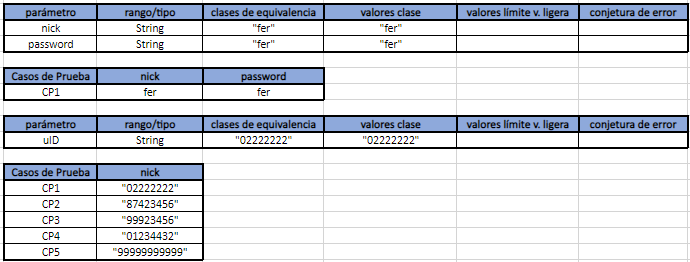

- **Tabla de GestorPropuestaCurso**
    - **Tabla realizarPropuesta**
   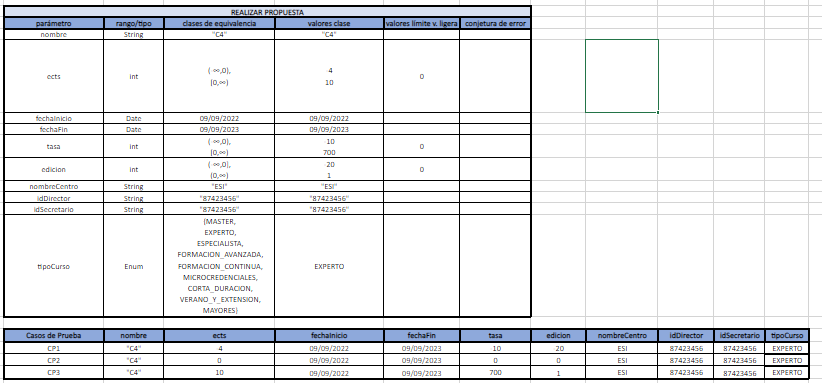

    - **Tabla de ObtenerCurso**
    - 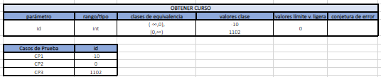

    - **Tabla de ObtenerCursosDenegados**
    - 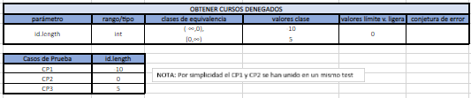

    - **Tabla de ObtenerCentros**
    - 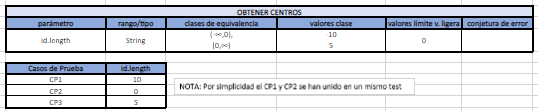

    - **Tabla de ObtenerSecretarios**
    - 

    - **Tabla de ObtenerProfesor**
    - 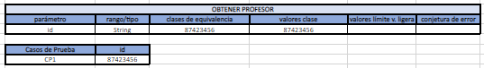

    - **Tabla de ObtenerCentro**
    - 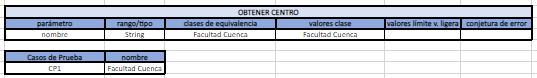

    - **Tabla de EvaluarPropuesta**
    - 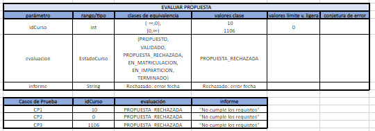
- **Tabla de GestorConsultas**
    - **Tabla de ObtenerCursos**
    - 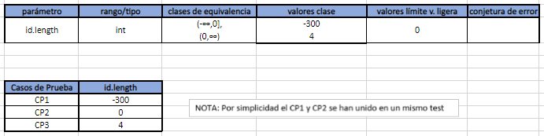
    - **Tabla de obtenerEdicion**
    - 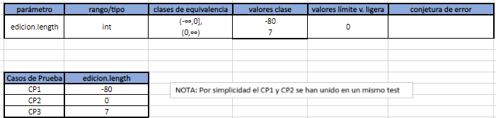
    - **Tabla de ObtenerEstado**
    - 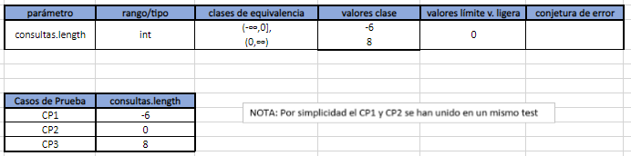
    - **Tabla de ObtenerTipoCurso**
    - 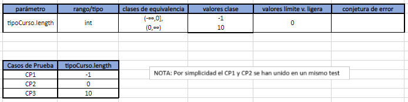
    - **Tabla de ObtenerIngresos**
    - 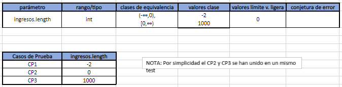

## Plan de mantenimiento 

Nuestro plan de mantenimiento se divide en las siguientes secciones:

* ### Alcance

Para garantizar el correcto funcionamiento del sistema se van a tener en cuenta principalmente los controladores como son el Gestor de consultas, el gestor del login y el gestor de las propuestas de los cursos.  
Además también debemos mantener aquellas clases que se encuentren dentro de la persistencia dado que se trata de las clases que tienen constante intercambio con la base de datos  

* ### Responsabilidades

Para que nuestro plan de mantenimiento sea correctamente ejecutado debemos asignar a una serie de personas que tengan unas funciones específicas en nuestro plan:
- **Personal encargado de realizar test en el sistema**
    En nuestro sistema debemos tener a una persona o equipo de personas que se encarguen de realizar un correcto testeo de las nuevas funcionalidades implementadas en el sistema y controlar que estas funciones no tienen conflictos con el resto del sistema.
- **Personal encargado de la gestion del versionado del sistema**
    Una vez finalizado el proyecto para asegurar el mantenimiento debemos tener un equipo encargado de versionar correctamente si se adhieren correctamente nuevas funcionalidades al sistema y demás de que las herramientas del sistema no generen problemas con sus actualizaciones. 
- **Personal encargado de analizar el sistma**
    El sistema al igual que durante su desarrollo debe tener un personal encargado de controlar la calidad del código así como puede ser controlar mediante *Sonar* la cantidad de *CodeSmells*, *Bugs*, *Security HotsPots*.
    
* ### Frecuencia
    
La frecuencia con la que se debe realizar tareas de mantenimiento dependerá de bastantes factores, como el uso del software, la complejidad del software, la necesidad de actualizaciones y cambios o la calidad de mantenimientos previos.

Idealmente, en cada sprint que se realice se debería trabajar en el mantenimiento del código previamente implementado.

Si se ignora durante un largo periodo de tiempo los esfuerzos de mantenimiento, futuros trabajo de mantenimiento será más costoso y complicado.

Por esto hemos decicido que la mejor opción será un mantenimiento continuo. Este mantenimiento suele usarse en software crítico para la organización, que se use constantemente y no pueda permitirse tiempo de inactividad.

En consecuencia, el mantenimiento continuo será el más óptimo, teniendo en cuenta la naturaleza de nuestro cliente y su necesidad de que el software este disponible en todo momento para la evaluación, consulta y propuestas de cursos.

* ### Revisión del plan de mantenimiento

Por lo general, el plan de mantenimiento del software debe revisarse regularmente para asegurarse de que sea adecuado y de su efectividad. La frecuencia de esta revisión depende de varios factores, similares a los factores de frecuencia del mantenimiento.

En general, se deberían revisar estos planes como mínimo una vez al año, aunque si hay cambios significativos en el código o la organización, es probable que se necesiten revisiones más frecuentes.

Es importante tener en cuenta que el plan de mantenimiento es un documento "vivo", que debe adaptarse a las necesidades cambiantes de la organización, el cliente y el código.

## conclusiones finales

Supra Software Engineering ha usado varias herramientas para el desarrollo y mantenimiento del software, como GitHub, Maven, Sonar, JUnit y JaCoCo. 

En el mantenimiento del proyecto, hemos usado principalmente SonarCloud para la realización de análisis del código. Gracias a esto detectamos una gran cantidad de CodeSmells, bugs y código duplicado. Que a lo largo de los Sprints 4 y 5 hemos ido reduciendo, hasta obtener buenos números.

También tuvimos que diseñar un plan de mantenimiento, basado en alcance, responsabilidades y frecuencia. Además este plan debe ser revisado para asegurar que siga siendo adecuado y efectivo.

